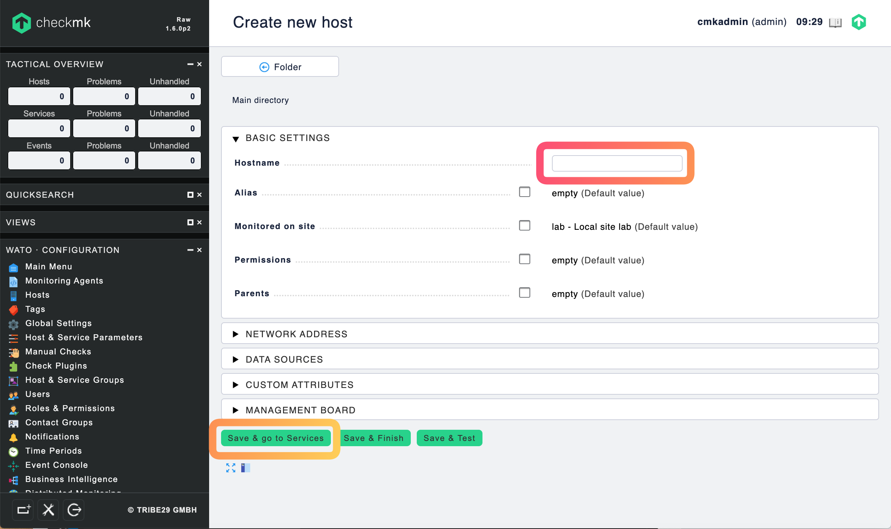

## LAB2 - Infrastructure monitoring
---

IT Infrastructure Monitoring Tools, like Zabbix and Check_MK, capture the availability of the IT infrastructure components in private and public clouds. These tools monitor and collate the availability and resource utilization metrics of servers, networks, database instances, hypervisors and storage.

### Exercise 1 - Adding a host in Zabbix to monitor

Login to Zabbix using the admin account. Then follow these steps:

Select Configuration->Hosts->Create Host. Then fill in the following and then go to the Template tab.

> Hostname: runner\<n\>.lab.mpt.local
> Visual name: runner\<n\>
> Group: Linux servers
> IP address: You can find out the IP address by pinging runner\<n\>.lab.mpt.local 
> DNS name: runner\<n\>.lab.mpt.local

Next click the "Template" tab and select

> Link new template: Template OS Linux

To do that, click the "Select" button to open the template. Check the desired template "Template OS Linux". When done click the "Add" link then the "Add" button to save.

Select *Monitoring* from the top menu bar. The "Dashboar" page should show the newly addred host. You can click through the sub-menus - *Problems, Overview, Web, Latest data, Graphs, Screens, Maps Disovery Service* to checkout information and metrics collected. The *Overview* tab should display the metrics Zabbix collected from the host. The *Problems* tab show the problems Zabbix detects for one or more metrics associate with the hosts. 

**Using Graphs**

If you would like view a hosts metric in graph, 

1. Click the *Hosts* tab under *Configuration*. 
2. Select the group, host, and graph metric on the top right of the page.
3. Choose the From and To window to display the graph over the time period.

**Configuring a trigger**

To configure a CPU overloaded trigger,

1. Go to *Configuration->Hosts*
2. Click on *Triggers* in the row of the host
3. Click on Create trigger to the right

Enter parameters in the ***Tigger*** tab.

> Name: CPU is overloaded on {HOST.NAME}
> Serverity: Warning
> Experession: {runner\<n\>:system.cpu.load[percpu,avg1].last()}>5
> OK event generation: Expression
> PROBLEM event generation mode: Single
> OK event closes: All problems
> Allow manual close [x]
> Enabled [x]


**Configuring email notification**

Click on *Administration*, and then *Media types* in the top navigation bar. You will see the list of all media types. Click on *Email*.

Enter parameters in the ***Media type*** tab.

> Name: Gmail
> type: Email 
> SMTP server: smtp.gmail.com
> SMTP server port: 587
> SMTP helo: gmail.com
> SMTP email: mpt.bootcamp@gmail.com
> Connection security: STARTTLS
> Authentication: Username and password
> Username: mpt.bootcamp@gmail.com
> Password: Mpt@9876
> Enabled [x]


**Enabling notification action**

Select menu *Configuration->Actions*. Then click "Report problem to Zabbix administrators" link.

On the *Operations* tab, find *Operations* line and click the *edit* link to open the Operation detail. Then add the "OnCall" group to "Send to User groups"


**Triggering a problem notification**

A simple way to trigger a problem email notification is to shutdown the zabbix agent on a monitoring host. From the Jupyterhub control console, open the Terminal to SSH into the remote host.

```console
ssh -i ~/.ssh/id_rsa_ubuntu ubuntu@runner<n>.lab.mpt.local
```

Once connected, then shutdown the Zabbix agent with this command

```console
sudo systemctl stop zabbix-agent
```

In about 5-10 minutes, you should receive an email notification.


**Acknowledging a problem alert**

To acknowledge a problem, go to *Monitoring->Problems*. The find the problem host. On the "Ack" column, click the "No" to open the form to put in the acknowlowedge information.


Enter the acknowledge message:


**Resolving a problem to clear an alert**

To fix and clear the unreachable alert we created by shutting the Zabbix agent, we just need to start the agent to fix the problem by executing this command at the runner host.

```console
sudo systemtl start zabbix-agent
```

You should receive an email notification the problem host is resolved.


### Exercise 2 - Adding a host in Check_MK to monitor

Login to Check_MK as the administrator. On the WATO view,

1. Select *Hosts->New Host*
2. Enter the Hostname, runner\<n\> , then click "Save & go to Services"
3. Click "Fix all missing/vanished" and "2 change" button on the top left of the page
4. Click "Activate the affected" button to start scanning the checks/services
5. After a few minutes, you should see a list of services discovered by Check_MK.





**Adding contact group to host for notification**

In order to receive alert notification, we need to associate a contact group to one or more hosts.

1. Select WATO->Hosts, then click the host to open the configuration page.
2. Check the *Permissions" section to add the "OnCall" contact group (highlight and click the error button or doubleclick on "OnCall")
3. Click "1 change" button to accept the change
4. Click "Activate affected"


