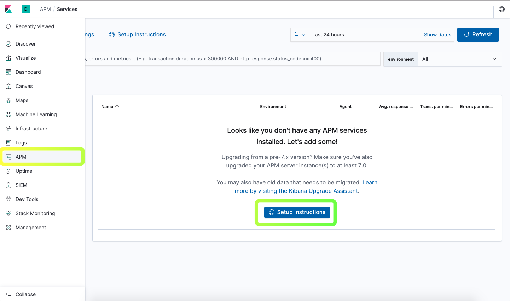
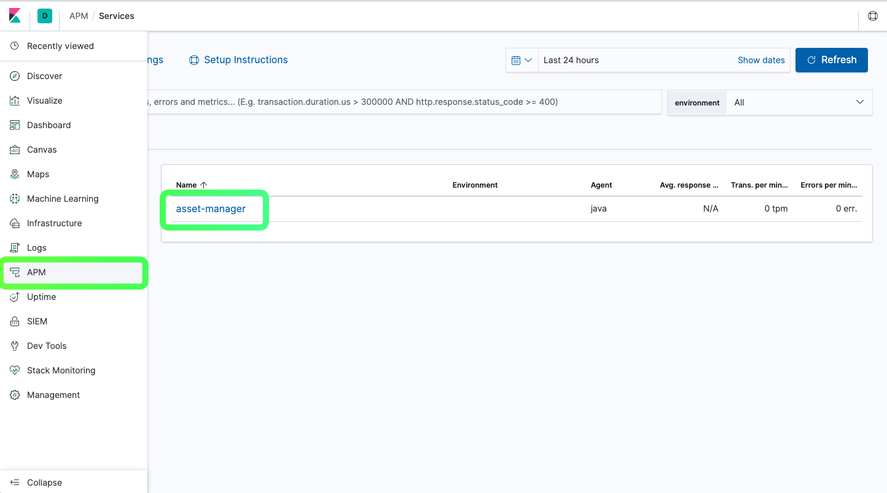
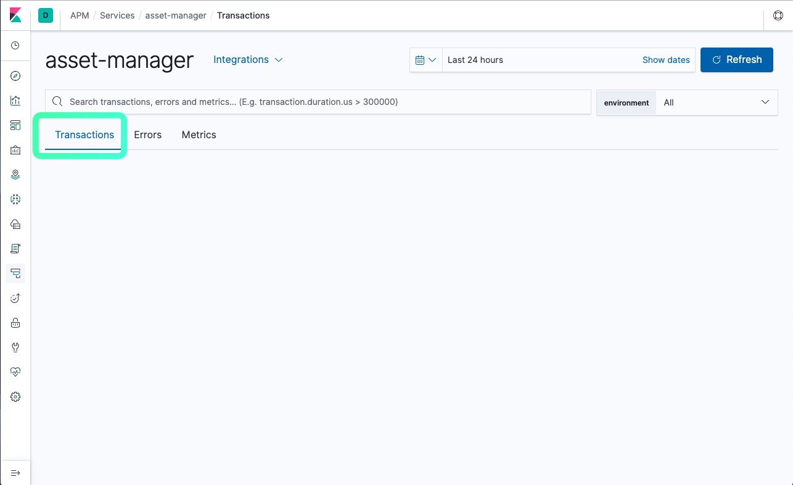
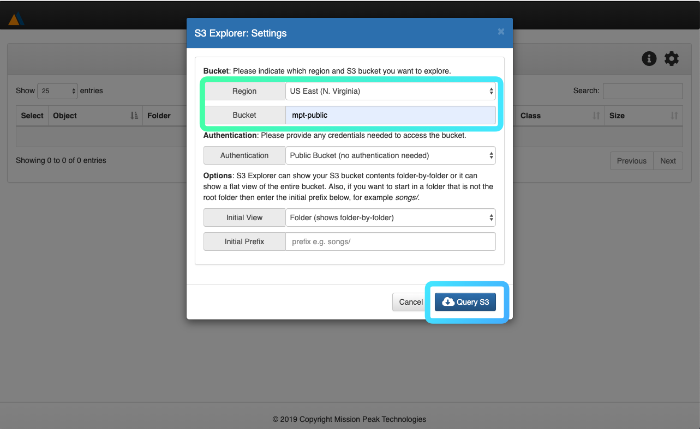
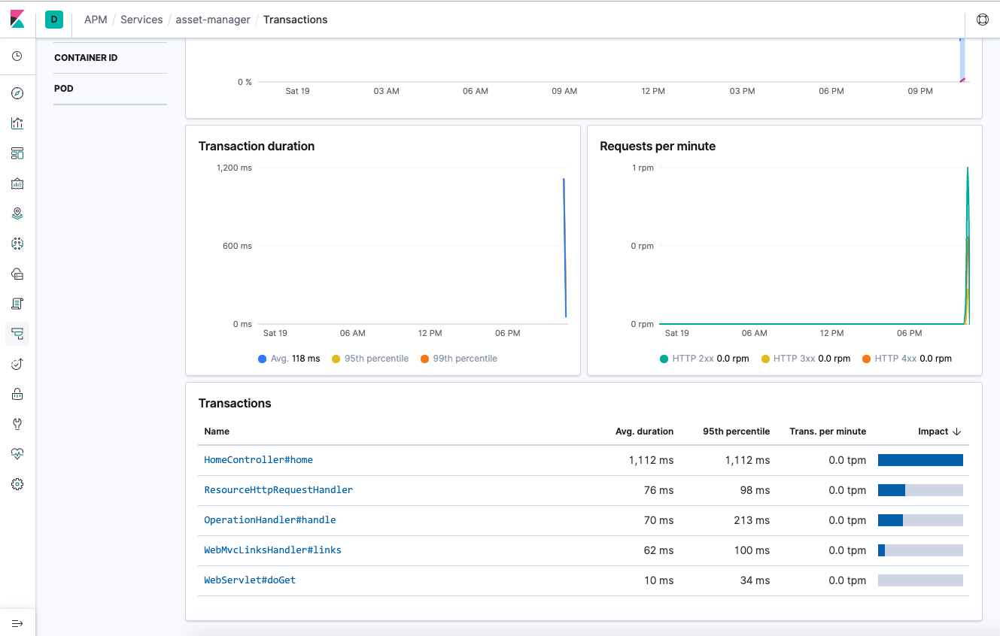
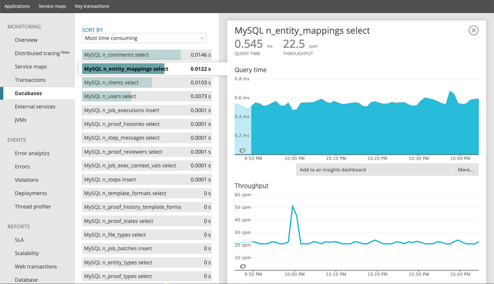

## LAB3 - Application performance monitoring (APM)
---
APM allows you to monitor software services and applications in real time collecting detailed performance information on response time for incoming requests, database queries, calls to caches, external HTTP requests, and more. This makes it easy to pinpoint and fix performance problems quickly.

In this lab, we will use Elastic APM to instrument the assets manager web application deployed in **Lab 1** to report performance metrics to Elasticsearch for visualization in Kibana with pre-configured dashboards. 

The most common way to setup APM for a Java application is to instrument the application with the -javaagent flag. For example,

```
java -javaagent:/path/to/elastic-apm-agent-<version>.jar -Delastic.apm.service_name=my-cool-service -Delastic.apm.application_packages=com.example,org.another.example -Delastic.apm.server_urls=http://localhost:8200 -jar my-application.jar
```

In Lab1, when settting up the monitoring serveragents, we have installed the Elastic APM server and agent.

### Exercise 1 - Verifying the APM server

Open the Elastic APM Server URL with the Chrome browser. Click the "Setup Instructions" see the setup instructions for different OS platform and application language.

> http://console\<n\>.missionpeaktechnologies.com:5601



To verify the APM server is running on the console machine, open the Terminal window from Jupyterhub and use the systemctl command to manage the APM server.

> http://console\<n\>.missionpeaktechnologies.com:8000


```console
$ sudo systemctl status apm-server
```

You should see somethings like this

```
● apm-server.service - Elastic APM Server
   Loaded: loaded (/lib/systemd/system/apm-server.service; enabled; vendor preset: enabled)
   Active: active (running) since Tue 2019-10-15 01:01:05 UTC; 5 days ago
     Docs: https://www.elastic.co/solutions/apm
 Main PID: 1279 (apm-server)
    Tasks: 14
   Memory: 5.9M
      CPU: 17.418s
   CGroup: /system.slice/apm-server.service
           └─1279 /usr/share/apm-server/bin/apm-server -e -c /etc/apm-server/apm-server.yml -path.home /usr/share/apm-server -path.config /etc/apm-server -path.da

Warning: Journal has been rotated since unit was started. Log output is incomplete or unavailable.
```

To start, stop, or restart the APM server, you can use this command:

```console
$ sudo systemctl start|stop|restart|status apm-server
```

To manually configure the APM server, you can edit the configuration file, /etc/apm-server/apm-server.yml. Below are the key configuration attributes. It is setup to 

1. It collects APM metrics from the agent on port 8200
2. Enables Kibana APM dashboard
3. Store the APM metrics in Elasticsearch

To view and search for the configuration parameters

```console
$ sudo cat /etc/apm-server/apm-server.yml | grep -C 10 "apm-server:" 
```

```
apm-server:
  host: "0.0.0.0:8200"

  # Enable Real User Monitoring (RUM) Support. By default RUM is disabled.
  rum:
    enabled: true

   kibana:
    # For APM Agent configuration in Kibana, enabled must be true.
    #enabled: false
    enabled: true

#-------------------------- Elasticsearch output --------------------------
output.elasticsearch:
  # Array of hosts to connect to.
  # Scheme and port can be left out and will be set to the default (`http` and `9200`).
  # In case you specify and additional path, the scheme is required: `http://localhost:9200/path`.
  # IPv6 addresses should always be defined as: `https://[2001:db8::1]:9200`.
  hosts: ['localhost:9200']
```

### Exercise 2 - Verifying the APM agent

From the Jupyterhub Terminal window, login to your *runner* host:

```console
$ ssh -i ~/.ssh/id_rsa_ubuntu ubuntu@runner<n>.lab.mpt.local
```

To verify the APM Java agent was installed in **Lab1**

```console
$ cd /usr/share/apm-agent/java
$ ls -ltr
```

You should see Java agent jar file.

```
-rw-r--r-- 1 root root 5059429 Oct 19 05:26 elastic-apm-agent-1.10.0.jar
```

### Exercise 3 - Instrumenting the Java application for APM

From your *runner* host, edit the application startup.sh script to include the agent library.

```console
$ sudo su -l
$ cd /apps/assets-manager/1.0.0/bin
$ cat startup.sh
```

Without instrumenting, the startup.sh should looks like below.

```
#!/bin/bash
#
set -x

# Set the defaullt JAVA_HOME for the OS family
OS_FAMILY="$(uname -s)"
case "${OS_FAMILY}" in
    Linux*)
        DEFAULT_JAVA_HOME="$(dirname $(dirname $(readlink -f $(which java))))"
        ;;
    Darwin*)
        DEFAULT_JAVA_HOME=$(/usr/libexec/java_home)
        ;;
    CYGWIN*)
        DEFAULT_JAVA_HOME=""
        ;;
    *)
        DEFAULT_JAVA_HOME=""
        ;;
esac

# Use the default JAVA_HOME if it is not set
JAVA_HOME=${JAVA_HOME:-${DEFAULT_JAVA_HOME}}
JAVA_OPTS="-Xmx1g"

# Start the JAVA project
RUN_DIR="$(dirname $0)/.."

cd $RUN_DIR
JAR_PATH="$(find ${RUN_DIR} -name 'assets-manager-[0-9]*.[0-9]*.[0-9]*.jar')"
[ -z "$JAR_PATH" ] && echo "ABORTED: JAR program not found!" && exit 1

$JAVA_HOME/bin/java $JAVA_OPTS -jar $JAR_PATH
```

Now, replace the content of the startup.sh with. **Note** to replace console\<n\> with your student number. For example console1 or console2, etc

```
#!/bin/bash
#
set -x

# Set the defaullt JAVA_HOME for the OS family
OS_FAMILY="$(uname -s)"
case "${OS_FAMILY}" in
    Linux*)
        DEFAULT_JAVA_HOME="$(dirname $(dirname $(readlink -f $(which java))))"
        ;;
    Darwin*)
        DEFAULT_JAVA_HOME=$(/usr/libexec/java_home)
        ;;
    CYGWIN*)
        DEFAULT_JAVA_HOME=""
        ;;
    *)
        DEFAULT_JAVA_HOME=""
        ;;
esac

# Use the default JAVA_HOME if it is not set
JAVA_HOME=${JAVA_HOME:-${DEFAULT_JAVA_HOME}}
JAVA_OPTS="-Xmx1g"

JAVA_APM=""

# Use Elastic APM agent if exists
if [ -f "/usr/share/apm-agent/java/elastic-apm-agent-1.10.0.jar" ]; then
JAVA_APM="-javaagent:/usr/share/apm-agent/java/elastic-apm-agent-1.10.0.jar \
 -Delastic.apm.service_name=asset-manager \
 -Delastic.apm.server_urls=http://console<n>.lab.mpt.local:8200 \
 -Delastic.apm.application_packages=com.openecs.assets"
fi

# Start the JAVA project

RUN_DIR="$(dirname $0)/.."

cd $RUN_DIR
JAR_PATH="$(find ${RUN_DIR} -name 'assets-manager-[0-9]*.[0-9]*.[0-9]*.jar')"
[ -z "$JAR_PATH" ] && echo "ABORTED: JAR program not found!" && exit 1

$JAVA_HOME/bin/java $JAVA_OPTS $JAVA_APM -jar $JAR_PATH
```

Now restart the assets manager to send APM metric to the APM server

```console
$ sudo systemctl status assets-manager
$ sudo systemctl restart assets-manager
$ sudo systemctl status assets-manager
```

Like any systemd service, you can use the following command to start, stop, restart or get status of a server. Ensure this Java web application is started in order to report APM metrics to the monitoring server.

```
$ sudo systemctl start|stop|restart|status <service-name>
```

### Exercise 4 - Exploring the APM metrics

Now open the APM dashboard again with this URL

> http://console\<n\>.missionpeaktechnologies.com:5601/app/apm

You should see now the Asset Manager application appears in the page. Click on it to open the dashboard page. Then select the Metrics tab




Click on the Transactions tab, you should see empty transactions information



To generate some transactions, open the following URL on the runner application server.

> http://runner\<n\>.missionpeaktechnologies.com:9000

Enter "mpt-public" for the bucket name . Then click on the links to browse through the assets.



Next, open the following URLs to create some more web transactions to report to APM server.

> http://runner\<n\>.missionpeaktechnologies.com:9000/monitor
> http://runner\<n\>.missionpeaktechnologies.com:9000/monitor/health
> http://runner\<n\>.missionpeaktechnologies.com:9000/monitor/metrics
> http://runner\<n\>.missionpeaktechnologies.com:9000/monitor/prometheus
> http://runner\<n\>.missionpeaktechnologies.com:9000/monitor/info
> http://runner\<n\>.missionpeaktechnologies.com:9000/monitor/env

Now you should be able to see the transaction trace information when you open the APM server dashboard.

> http://console\<n\>.missionpeaktechnologies.com:5601/app/apm#/services/asset-manager/transactions



### Conclusion

For commerical APM server and agent like New Relic, you can see more APM metrics to pinpoint and fix performance problems quickly. For example,




