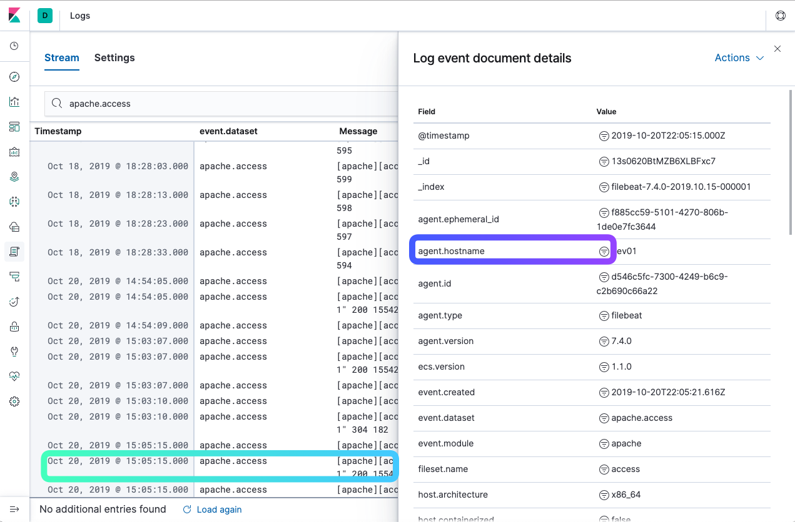
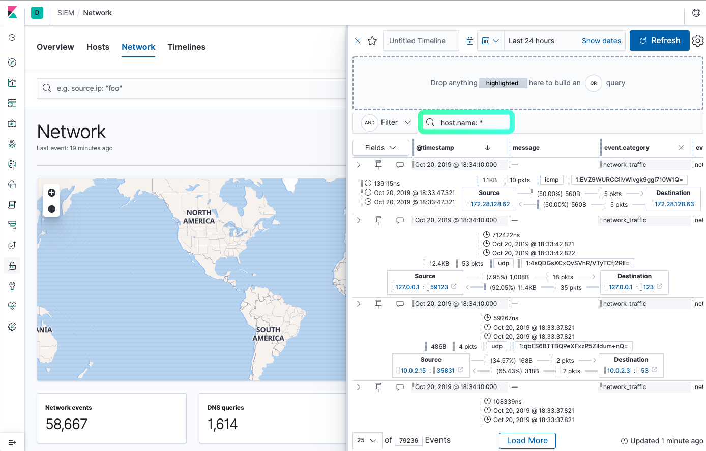

## LAB4 - Log aggregation and SIEM
---

Logs give you an idea of what is happening and what your system is doing. If you have a variety of hosts, then you might end up with different logs hosted on different locations. Log aggregation is a good way to bring together all these logs into one location to analyze, search, and report on the data.

The ELK is popular log management and analytics tools to collect, monitor and analyze modern applications and the IT infrastructure.

### Exercise 1 - Enabling log aggregation

In **Lab1**, we already installed the ELK monitoring stack and various collecting agents. In this execise, we will enable the agents to collect logs.

Filebeat modules provide a quick way for you to get started processing common log formats. They contain default configurations, Elasticsearch ingest node pipeline definitions, and Kibana dashboards to help you implement and deploy a log aggregation solution.

The following command enables and runs the apache, mysql, and system modules.

From the Jupyterhub Terminal window, login (SSH) to the runner host where the LAMP and Assets Manager applications are running.

```console
ssh -i ~/.ssh/id_rsa_ubuntu ubuntu@runner<n>.lab.mpt.local
```

Once login to the *runner* host, run this command to enable the predefined logs collection.

```console
sudo filebeat modules list
sudo filebeat modules enable system mysql apache
sudo systemclt restart filebeat
```

To confirm Filebeat is running,

```console
sudo systemctl status filebeat
sudo cat /var/log/filebeat/filebeat
```

With the log collecting modules enabled, it will ship the log files from the following locations:

> /var/log/mysql/error.log
> /var/log/syslog
> /var/log/apache2/access.log
> /var/log/apache2/error.log


### Exercise 2 - Analyzing the aggregated logs with Kibana Logs app.

Kibana provides a Logs app to explore and analyze the aggregated logs. To access the Logs app, open the Kibana console with the Chrome browser.

> http://console\<n\>.missionpeaktechnologies.com:5601/app/infra#/logs


**Using search**

Use the search bar to perform ad hoc searches for specific text. You can also create structured queries using Kibana Query Language. For example, enter host.hostname : "runner1" to see only the information for runner1.

* Click *Time* filter calendar, then choose the time range for the logs. 
* To highlight a word or phrase in the logs stream, click *Highlights* and enter your search phrase.
* Click *Stream live* to start streaming live log data, or click Stop streaming to focus on historical data.

To search the "Firefox" user browser in the Apache log, enter

> event.dataset: "apache.access" and user_agent.name: "Firefox" 

See [Kibana Query Language](https://www.elastic.co/guide/en/kibana/7.4/kuery-query.html) for more syntax.


To inspect a log event, hover over it, then click the View details icon  beside the event. This opens the Log event document details popout that shows the fields associated with the log event.





Next, let's search Linux syslog for the sudo event by entering the following search pattern:

> "session opened for user root by"

You should see a list of sudo events by your student\<n\> user. You can customize the return results as well.


To view all log files from a host, enter the hostname in the Search Bar

> host.name: runner\<n\>.lab.mpt.local

In additional to log aggregation analyze, you also use Kibana SIEM app to analyze host-related and network-related security events as part of proactive monitoring. In **Lab1** you already installed Auditbeat and Packetbeat agents, to provide additional events collection.


The SIEM app enables analysis of host-related and network-related security events as part of alert investigations or interactive threat hunting, including the following:

* Host security event analysis
* Network security event analysis
* Timeline event viewer

### Exercise 3 - Analyzing host security

1. Open the Kibana console and select the "SEIM" app. 
2. Then click "View hosts" to open the dashboard to view key metrics regarding host-related security events, and a set of data tables
3. Click through these tabs, "All Hosts", "Authentications", "Uncommon processes", and "Events" to see additional details.


### Exercise 4 - Exploring the network activities

1. Open the Kibana console and select the "SEIM" app. 
2. Then click "View netowrk" to open the dashboard to view key network activity metrics.


### Exercise 5 - Using Timeline event view

Timeline let you easily drag objects of interest into the Timeline Event Viewer to create exactly the query filter they need to get to the bottom of an alert. 

1. Open the Kibana console and select the "SEIM" app. 
2. Then click "Timeline" to open the Timeline Event Viewer.
3. Enter the filter pattern to see all inbount and outbound network traffic

> host.name: *




### Exercise 6 - Using pre-built dashboards

Kibana provides many pre-built dashboard that you can used to visualize events collected.

1. Open the Kibana dashboard
> http://console\<n\>.missionpeaktechnologies.com:5601

2. Select the "Dashboard" app and enter Login to filter only the dashboards


3. Click on "[Auditbeat System] Login Dashboard ECS" to see all login activities.

4. Go back to the Dashboard page and search for all Auditbeat dashboard

> Auditbeat

### Conclusion

There are many commercial Log aggregation and analytics tools like Splunk, Graylog2, Sumo Logic, etc. But Elastic ELK is very simple to setup and use.


