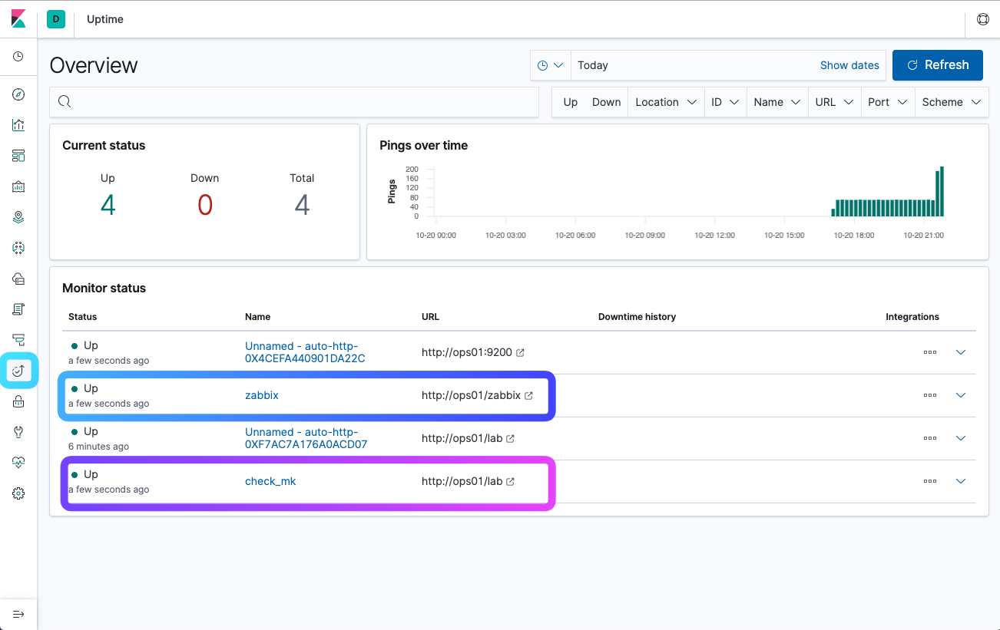
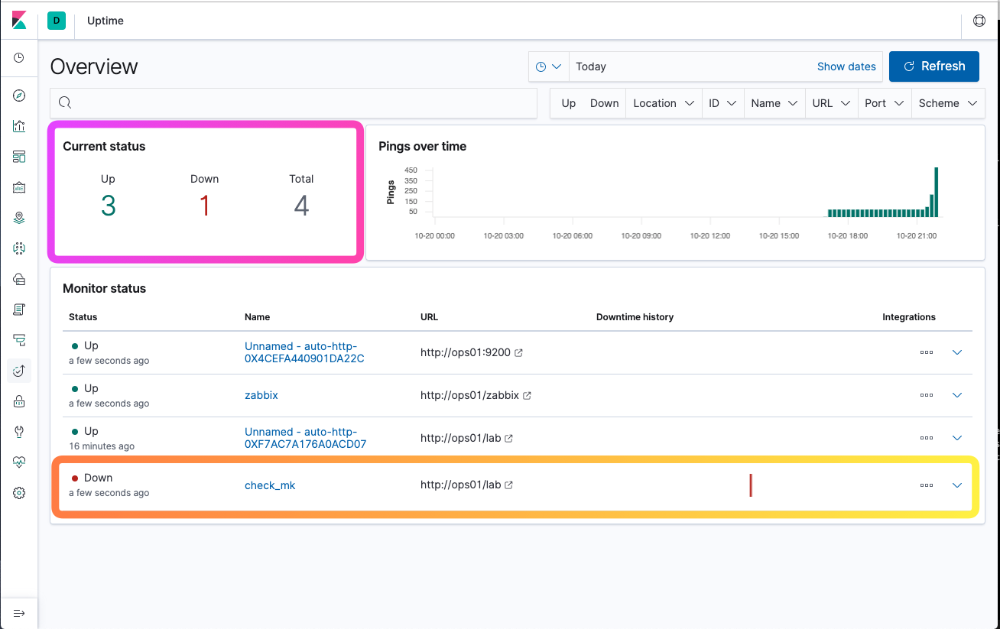

## LAB5 - Implementing meta monitoring
---

Implementing a highly reliable method to check on the availability of monitoring systems is the key to the success of a meta-monitoring system. During the DC-only era, the options to implement reliable meta-monitoring were limited. But, with the availability of cloud-based infra and SAS monitoring applications that task has become much simpler as we would see in the subsequent sections.

### Exercise 1 - Implementing a meta-monitoring

With one data center and no SaaS based monitoring service, the meta monigtoring optionsare limited. In this exercise, we will show you how to use Elastic Heatbeat agent to monitor both Check_MK and Zabbix.

1. From the Jupyterhub Terminal window, login the the runner host where Heatbeat is installed.

```console
ssh -i ~/.ssh/id_rsa_ubuntu ubuntu@runner<n>.lab.mpt.local
```

2. Verify Heartbeat is running

```console
sudo systemctl status heartbeat-elastic
```

It should return **Active and running**

```
heartbeat-elastic.service - Ping remote services for availability and log results to Elasticsearch or send to Logstash.
   Loaded: loaded (/lib/systemd/system/heartbeat-elastic.service; enabled; vendor preset: enabled)
   Active: active (running) since Sun 2019-10-20 19:28:00 UTC; 8h ago
```

3. Configuring Heartbeat 

```
# /etc/heartbeat/monitors.d/check_mk.yml
- type: http
  name: check_mk
  schedule: '@every 5s'
  urls: ["http://ops01/lab"]
  check.response.status: 200
```

```
# /etc/heartbeat/monitors.d/zabbix.yml
- type: http
  name: zabbix
  schedule: '@every 5s'
  urls: ["http://ops01/zabbix"]
  check.response.status: 200
```

4. Using Elastic Uptime

By using the new Elastic Uptime solution, they can detect when services are down or responding slowly. With alerting, they can get proactively notified even before those services are called by the application. 




Exercise 2 - Simulating downtime

```console
sudo su -l
omd stop lab
```

Now check the Kibana Uptime dashboard. You should see the Check_MK server is down.



Now start Check_MK again

```console
sudo su -l
omd start lab
```

Similarly, you can stop apache server to simulate Zabbix being down.

```console
sudo systemctl stop apache2
``` 
