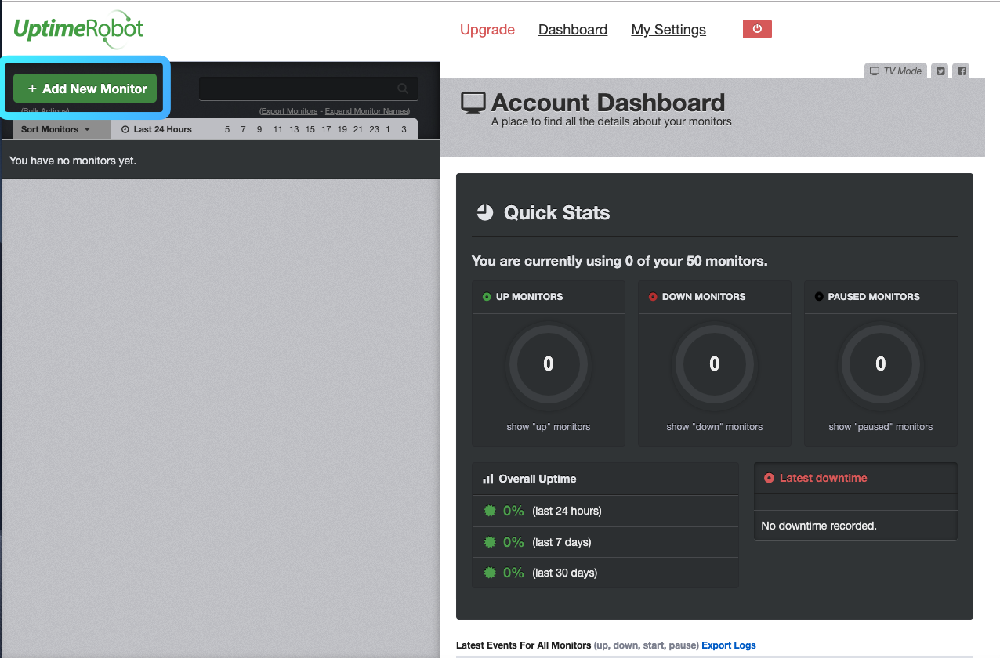
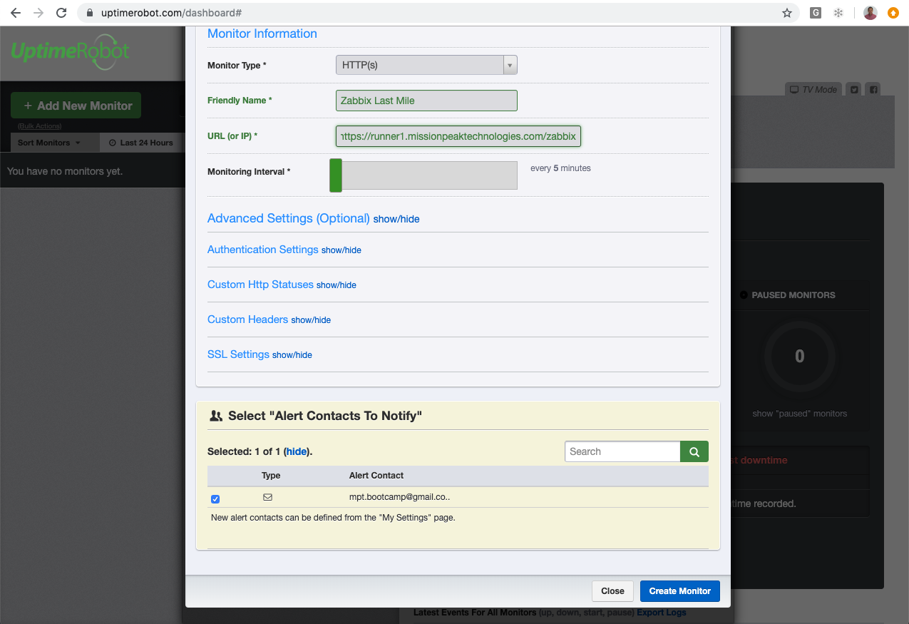
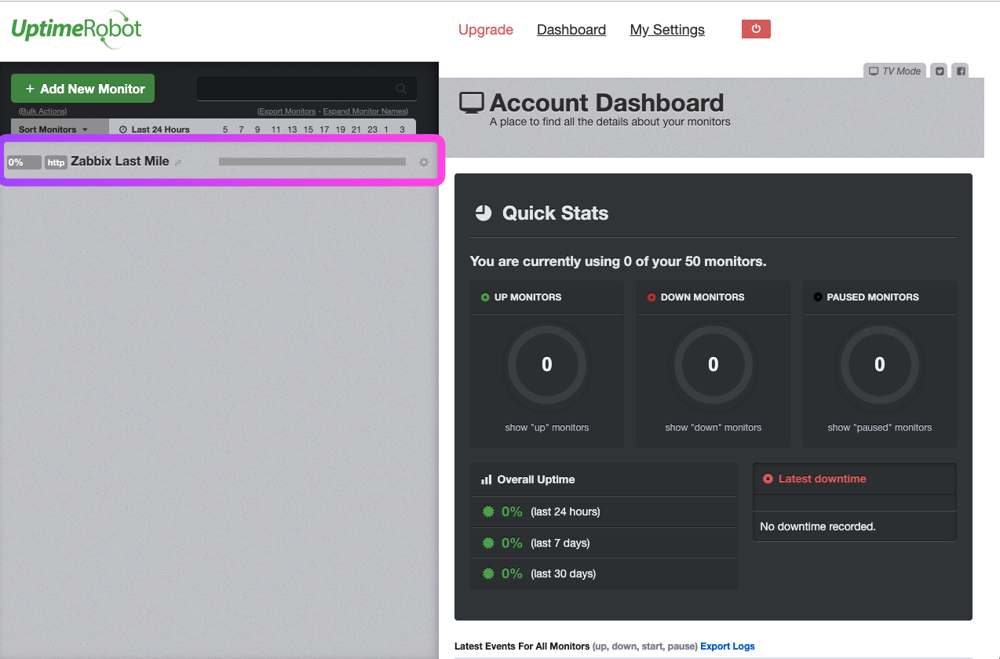
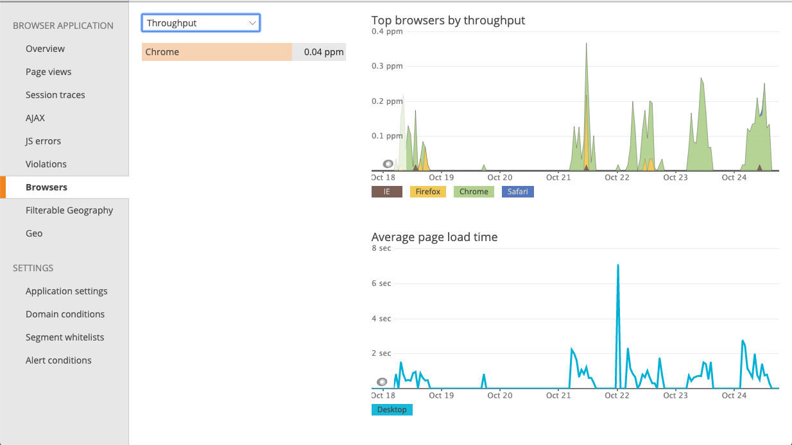

## LAB6 - Implementing a last-mile monitoring
---

What if your monitoring systems fail? How do you even know when a monitoring system has failed? You need to monitor it, so how should you monitor the monitoring systems. An approach is to use last-mile monitoring tools like

* [UptimeRobot](https://uptimerobot.com/)
* [New Relic](https://newrelic.com/signup?trial=apm)
* [PagerDuty](https://www.pagerduty.com)
* [Uptime](https://uptime.com)
* [Pingdom](https://www.pingdom.com/sign-up/)
* [CatchPoint](https://www.catchpoint.com)
* [Apica](https://resources.apicasystems.com/trial)

### Exercise 1- Using *UptimeRobot* for last-mile monitoring

A cloud-based monitoring service can be used to cover last-mile monitoring. If that service is available, it can be used to replace meta-monitoring, provided that meta-monitoring endpoints are accessible from the Internet as REST APIs or health-check URLs.

1. Open the following URL to sign up
https://uptimerobot.com/signUp

2. Enter the following information

> First and Last Name
> E-Mail
> Password

3. Open your email to activate the account.
4. Then login to UptimeRobot to add a new monitor

> Monitor Type: HTTP(s)
> Friendly Name: Zabbix Last Mile
> URL: http://runner\<n\>.missionpeaktechnologies.com/zabbix
> [x] Alert Contact

Some commerical tools, like New Relic, provides additional features for last mile monitoring the extend visibility into frontend and usage metrics, and code-level visibility for web applications—including single-page apps—at every point in the delivery chain. It gives you visibility into the impact of frontend performance on the customer experience. 

### Conclusion

Whether you using open source or commericial last-mile monitoring tools, when you have a real-time view into what happens as customers use your software, everyone benefits:

* Improve customer satisfaction and loyalty
* Make better software decisions 
* Foster collaboration across the organization
* Drive positive business outcomes
* Predict what’s next for your customer experience