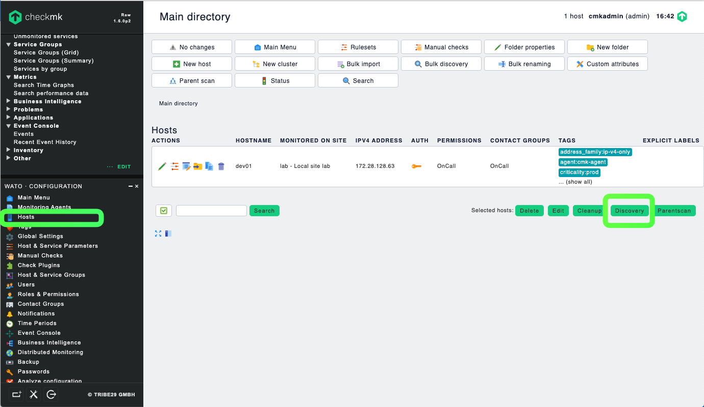
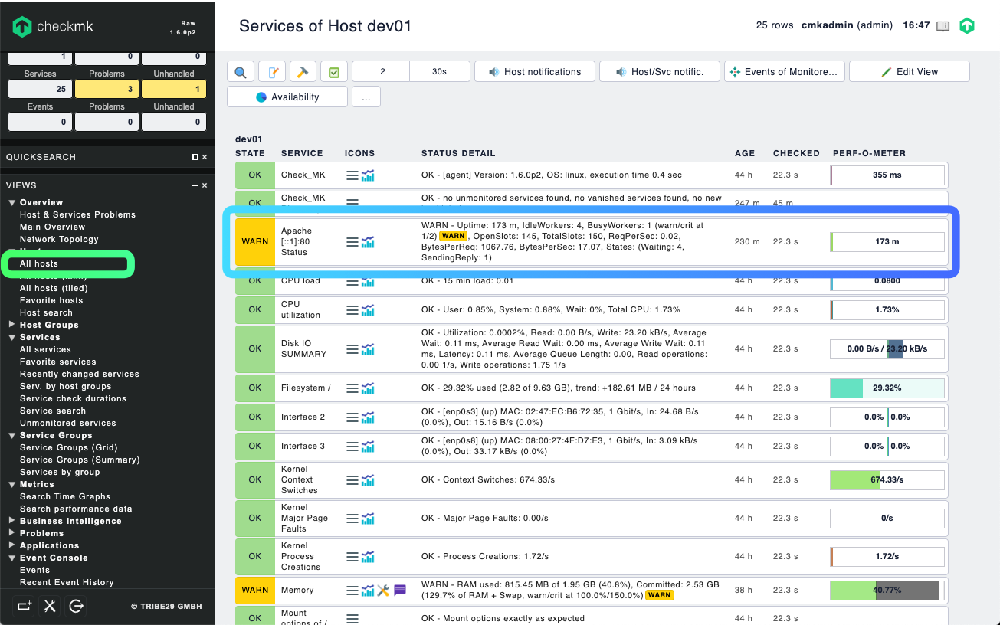
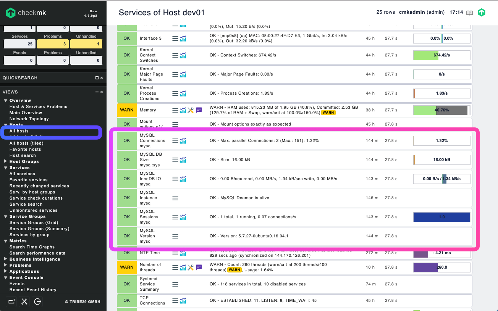

## LAB7 (Optional) - Platform Monitoring
---

Proactive monitoring should include platform serivces monitoring, like MySQL, Appache, MongoDB, HAProxy, etc. In this lab, you will learn how to monitor Apache webserver and MySQL using Check_MK plugins.


### Exercise 1 - Configuring Apache webserver using Check_MK

In this exercise, we will setup Apache monitoring using its server-status module. Login to Jupypter console with your student account

> https://console\<n\>.missionpeaktechnologies.com:8000

1. Open the Terminal windows to SSH into the remote host to enable apache status monitoring.

```console
$ ssh -i ~/.ssh/id_rsa_ubuntu ubuntu@runner\<n\>.lab.mpt.local
$ sudo a2enmod status.load 
```

2. Edit the apache status configuration file to allow Check_MK monitoring

```console
$ sudo vi /etc/apache2/mods-enabled/status.conf
```

Find "#Require ip 192.0.2.0/24" add the line below it

> Require ip 0.0.0.0

Save the change. The new configuration file should looks like below:

```
<IfModule mod_status.c>
        # Allow server status reports generated by mod_status,
        # with the URL of http://servername/server-status
        # Uncomment and change the "192.0.2.0/24" to allow access from other hosts.

        <Location /server-status>
                SetHandler server-status
                Require local
                #Require ip 192.0.2.0/24
                Require ip 0.0.0.0
        </Location>

        # Keep track of extended status information for each request
        ExtendedStatus On

        # Determine if mod_status displays the first 63 characters of a request or
        # the last 63, assuming the request itself is greater than 63 chars.
        # Default: Off
        #SeeRequestTail On


        <IfModule mod_proxy.c>
                # Show Proxy LoadBalancer status in mod_status
                ProxyStatus On
        </IfModule>

</IfModule>
```

3. Now download the apache status check plugin to your runner host.

```console
$ cd /usr/lib/check_mk_agent/plugins
$ sudo wget http://console<n>.lab.mpt.local/lab/check_mk/agents/plugins/apache_status
$ sudo chmod 744 apache_status

# Run the command manually to verify it is working
$ sudo /usr/lib/check_mk_agent/plugins/apache_status

# Restart Apache
$ sudo systemctl restart apache2
$ sudo systemctl status apache2
```

4. Now login to the Check_MK console as the administrator to run a discover to the new apache check

> https://console\<n\>.missionpeaktechnologies.com/lab

Go to WATO->Hosts to open the hosts list page. Then click the "Discovery" button



In a few minutes you should see the "Apache Status" be discovered. You can view it from VIEW->Hosts->All hosts, then select runner\<n\> and "Services".




### Exercise 2 - Monitoring MySQL server using Check_MK

With similar steps, you can add MySQL monitoring to Check_MK.

Login to Jupypter console with your student account

> https://console\<n\>.missionpeaktechnologies.com:8000

1. Open the Terminal windows to SSH into the remote host to create a MySQL monitoring user.

```console
$ ssh -i ~/.ssh/id_rsa_ubuntu ubuntu@runner\<n\>.lab.mpt.local
$ sudo su -l
$ mysql -u root -p -A
```

Run the followng MySQL command to create the monitoring user.

```console
mysql> grant select, show databases on *.* to 'mptmonitor'@'%' identified by 'mptmonitor@9876';
mysql> flush privileges;
```

2. Next, download the MySQL check plugin on your *runner* host and run a local check.

```console
$ sudo su -l
$ cd /usr/lib/check_mk_agent/plugins
$ wget http://console<n>.lab.mpt.local/lab/check_mk/agents/plugins/mk_mysql
$ chmod 744 mk_mysql
$ ./mk_mysql
```

3. Create a MySQL check configuration file on your *runner* host.

```console
$ sudo su -l
$ mkdir -p /etc/check_mk
$ vi /etc/check_mk/mysql.cfg
```
Paste the content below and save the change

```
[client]
user=mptmonitor
password=mptmonitor@9876
```

4. Since configuration file contain password in plain text, we need to limit the access to the *root* user

```console
$ sudo chmod 400 /etc/check_mk/mysql.cfg
```

5. Restart the Check_MK agent, xinetd

```console
$ sudo systemctl restart xinetd
```

6. Last, login to the Check_MK console as the administrator to run a discover to the new apache check

> https://console\<n\>.missionpeaktechnologies.com/lab

Go to WATO->Hosts to open the hosts list page. Then click the "Discovery" button

In a few minutes you should see the "MySQL" services being discovered. You can view it from VIEW->Hosts->All hosts, then select runner\<n\> and "Services".




---
## END
