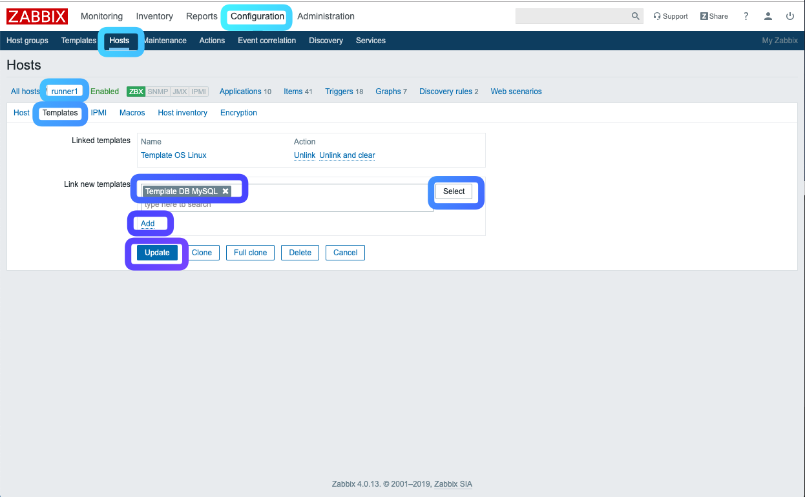

## LAB7 (Optional) - Platform Monitoring
---

With infrastructure monitoring, we mainly focus on monitoring physical and virtual device, servers, virtual machines, network switches, and routers. You can also use Zabbix and Check_MK to monitor platform services like Apache, MySQL, HAProxy, Kafka, MongoDB, etc.


### Exercise 1 - Monitoring Apache in Check_MK

Login to Jupypterhub Terminal *console* with your *student* account.

> https://console\<n\>.missionpeaktechnologies.com:8000

1. First, you need to enable the Apache module to allow extended status for monitoring on the *runner* host where Apache is running.

```console
$ ssh -i ~/.ssh/id_rsa_ubuntu ubuntu@runner\<n\>.lab.mpt.local
$ sudo a2enmod status.load 
```

2. Next, edit the apache status configuration file to allow Check_MK to collect the Apache status metrics.

```console
$ sudo vi /etc/apache2/mods-enabled/status.conf
```

Find "#Require ip 192.0.2.0/24" and replace the line below and save the change.

> Require ip 0.0.0.0

The new configuration file should looks like below:

```
<IfModule mod_status.c>
        # Allow server status reports generated by mod_status,
        # with the URL of http://servername/server-status
        # Uncomment and change the "192.0.2.0/24" to allow access from other hosts.

        <Location /server-status>
                SetHandler server-status
                Require local
                #Require ip 192.0.2.0/24
                Require ip 0.0.0.0
        </Location>

        # Keep track of extended status information for each request
        ExtendedStatus On

        # Determine if mod_status displays the first 63 characters of a request or
        # the last 63, assuming the request itself is greater than 63 chars.
        # Default: Off
        #SeeRequestTail On


        <IfModule mod_proxy.c>
                # Show Proxy LoadBalancer status in mod_status
                ProxyStatus On
        </IfModule>

</IfModule>
```

3. Then download the apache status check plugin to the *runner* host.

```console
$ sudo su -l
$ cd /usr/lib/check_mk_agent/plugins
$ wget http://console<n>.lab.mpt.local/lab/check_mk/agents/plugins/apache_status
$ chmod 744 apache_status

# Run the command manually to verify it is working
$ ./apache_status

# Restart Apache
$ systemctl restart apache2
$ systemctl status apache2
```

4. Last, login to the Check_MK console as the administrator to run a discover for the Apache check.

> https://console\<n\>.missionpeaktechnologies.com/lab

Go to WATO->Hosts to open the hosts list page. Click the "Discovery" button, then "Change" and "Activate affected"


In a few minutes you should see the "Apache Status" service on VIEW->Hosts->All hosts when opening the runner\<n\> link.


### Exercise 2 - Monitoring MySQL using Check_MK

Similary, we can add MySQL monitoring to Check_MK. Login to Jupypterhub console.

> https://console\<n\>.missionpeaktechnologies.com:8000

1. Open the Terminal windows to SSH into the *runner* host to create a MySQL monitoring user.

```console
$ ssh -i ~/.ssh/id_rsa_ubuntu ubuntu@runner\<n\>.lab.mpt.local
$ sudo su -l
$ mysql -u root -p -A
```

Run the MySQL commands to create the monitoring user.

```console
mysql> grant select, show databases on *.* to 'mptmonitor'@'%' identified by 'mptmonitor@9876';
mysql> flush privileges;
```

2. Next, download the MySQL plugin to your *runner* host.

```console
$ sudo su -l
$ cd /usr/lib/check_mk_agent/plugins
$ wget http://console<n>.lab.mpt.local/lab/check_mk/agents/plugins/mk_mysql
$ chmod 744 mk_mysql
```

3. Create the MySQL check configuration file on your *runner* host.

```console
$ sudo su -l
$ mkdir -p /etc/check_mk
$ vi /etc/check_mk/mysql.cfg
```
Paste the content below and save the change

```
[client]
user=mptmonitor
password=mptmonitor@9876
```

4. Since configuration file contain password in plain text, we need to limit the access to the *root* user

```console
$ chmod 400 /etc/check_mk/mysql.cfg
```

5. Restart the Check_MK agent, xinetd

```console
$ sudo systemctl restart xinetd
```

6. Last, login to the Check_MK console as the administrator to run a discover for the MySQL check

> https://console\<n\>.missionpeaktechnologies.com/lab

Go to WATO->Hosts to open the hosts list page. Click the "Discovery" button, then "Change" and "Activate affected"

In a few minutes you should see the "MySQL" services being discovered when viewing the host services, VIEW->Hosts->All hosts, then select runner\<n\> and "Services".


### Exercise 3 - Monitoring MySQL with Zabbix

First we need to setup the mysql credential file for Zabbix on the MySQL server host, *runner*. From the Jupyterhub console,

```console
$ ssh -i ~/.ssh/id_rsa_ubuntu ubuntu@runner\<n\>.lab.mpt.local
$ sudo su -l
$ vi /var/lib/zabbix/.my.cnf
```

Paste the content below and save.

```
[client]
user = mptmonitor
password = mptmonitor@9876
```

Now go to your Zabbix Server web interface. Click on 'Configuration', 'Hosts' and select the *runner* host. Then select the "Template" tab  to add "Template DB MySQL" to the host.




---
## END
