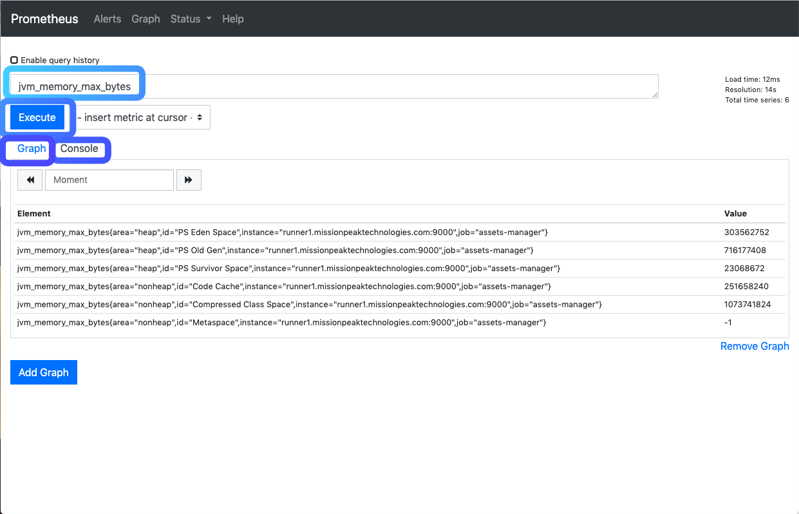
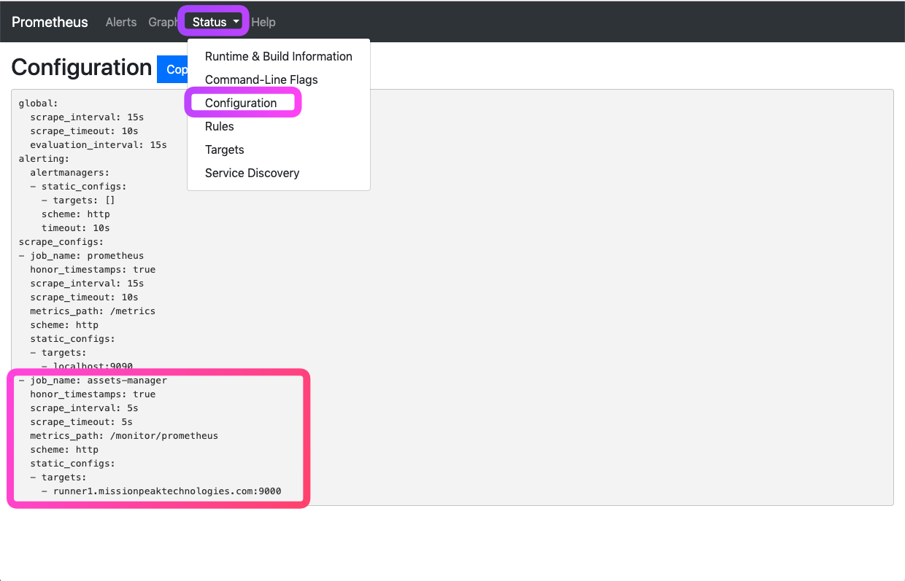
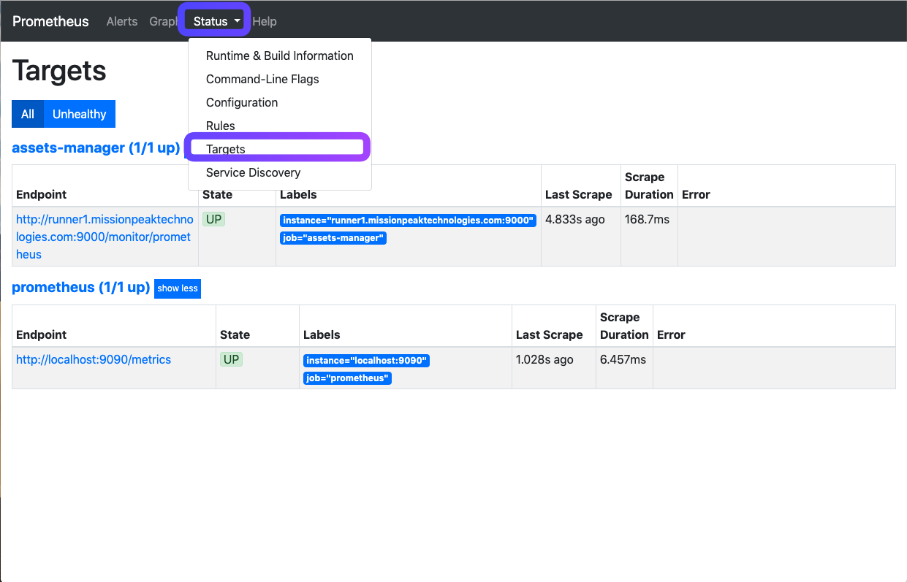
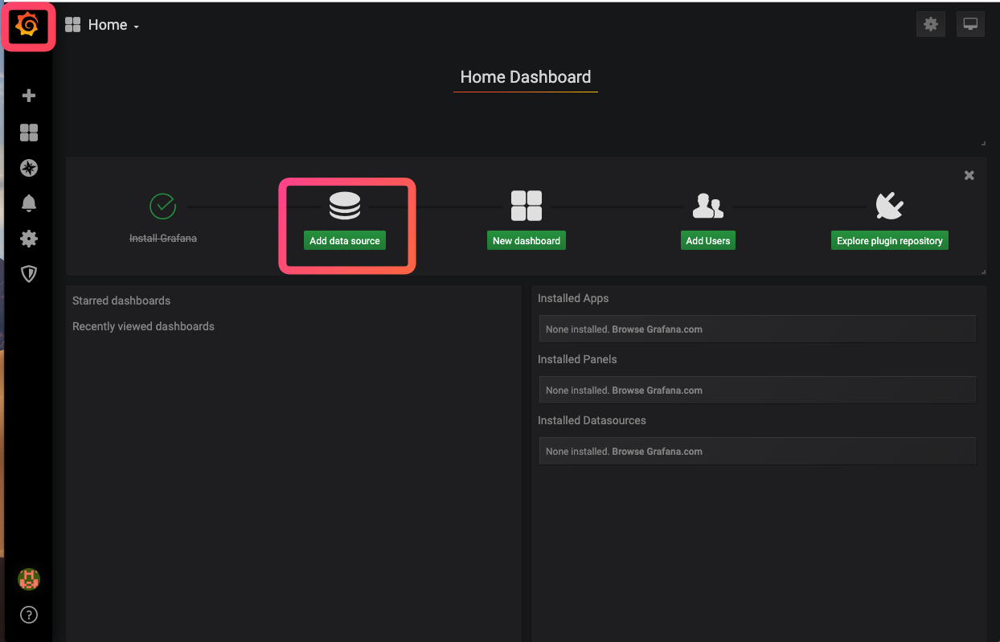
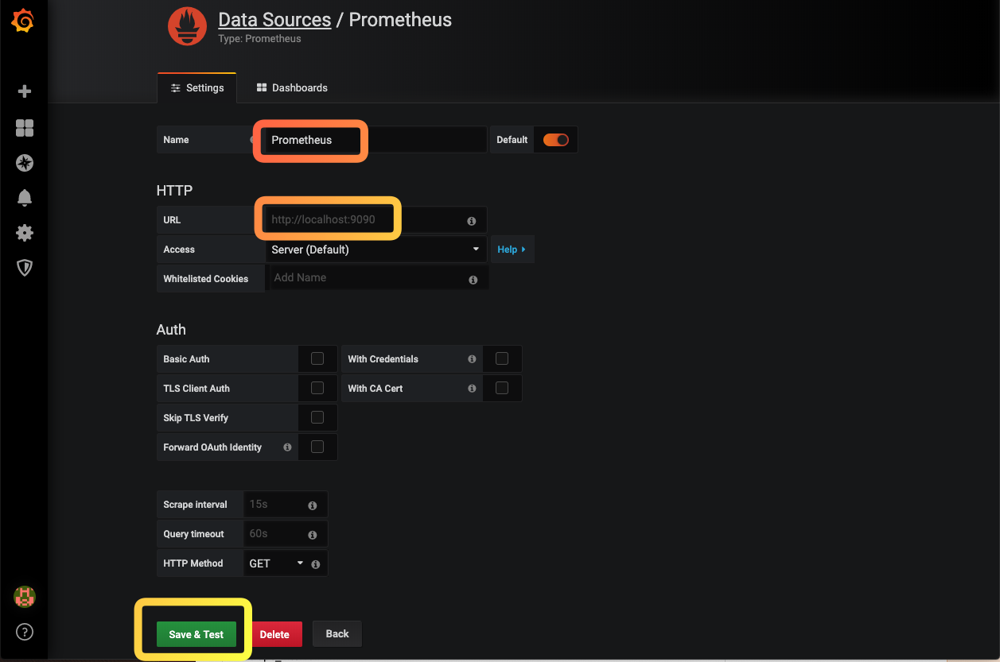
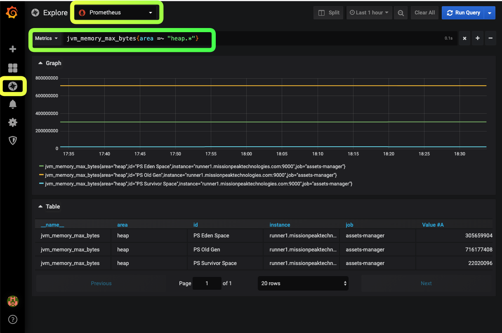

## LAB8 (Opptional) - Using Prometheus and Grafana
---

Prometheus monitoring has become the standard for monitoring Kubernetes clusters. Grafana integration allows you to aggregate a global view of your clusters in a single, logical place and provides long term storage (Time Series Database) for all of your microservices or Kubernetes metrics.


### Exercise 1 - Configuring a service scraping

The Promeetheus server can scrape an application services with the Prometheus metrics exposed. In this exercise, will be using our Assets Manager web application as a example,

1. Viewing the Prometheus application metrics exposed by the application

> http://runner\<n\>.missionpeaktechnologies.com:9000/monitor/prometheus

2. Configuring Prometheus to monitor a target application

To achieve this, add the following job definition to the scrape_configs section in prometheus.yml and restart Prometheus

```console
$ sudo vi /apps/prometheus/2.9.1/prometheus.yml
```

Then append the following lines under the **scrape_configs:** section

```
  - job_name: "assets-manager"
    scrape_interval: 5s
    scheme: http
    metrics_path: "/monitor/prometheus"

    static_configs:
    - targets: ['runner<n>.missionpeaktechnologies.com:9000']
```

3. Restart Prometheus

```console
$ sudo systemctl restart prometheus
$ sudo systemctl status prometheus
```

4. Now let's view the metrics with the Prometheus console. Open the URL below

> http://console\<n\>.missionpeaktechnologies.com:9090

Then filter only "jvm_memory_max_bytes" and click the **Execute** button. Browse the **Console** or ** **Graph** tab to see the results



To the configured scrapers and targets, click "Status->Configuration" and Status->Targets"





#### Prometheus Query Language Syntax

Here is a simple query language syntax commonly used.

> \<time series selector\>[{filter="regex",...}][range]

For example,

> jvm_memory_max_bytes{area =~ "heap.*"}[1d]
> system_cpu_usage{instance =~ "runner.*"}

**Filter operators**

* =  Select labels that are exactly equal to the provided string.
* != Select labels that are not equal to the provided string.
* =~ Select labels that regex-match the provided string.
* !~ Select labels that do not regex-match the provided string.

**Range**

* s - seconds
* m - minutes
* h - hours
* d - days
* w - weeks
* y - years


### Exercise 2 

Like Kibana, Grafana is an open source visualization tool that can be used on top of a variety of different data stores, like Prometheus, Graphite, InfluxDB, and also Elasticsearch.

In this exercise, we will add Prometheus as a data source in Grafana. Open the Grafana console and login as admin/admin.

> http://console\<n\>.missionpeaktechnologies.com:3000

To create a Prometheus data source:

1. Click on the Grafana logo to open the sidebar menu.
2. Click on "Data Sources" in the sidebar.
3. Click on "Add New".
4. Select "Prometheus" as the type.
5. Set the appropriate Prometheus server URL:

> http://localhost:9090/

Click "Save and Test" to save the new data source.

**Note**, here we use localhost because Prometheus run on the same server as Grafana.





Now you can query the prometheus metrics the same way when using Prometheus console. For example

1. Select *Explore* from the Grafana menu
2. Pick Prometheus as the data source on the top left screen
3. Enter the metric filter

> jvm_memory_max_bytes{area =~ "heap.*"}



Both the Grafana and Prometheus websites provide very good documentation and examples on how to visualize data. Grafana.com also maintains a collection of shared dashboards which can be downloaded and customized for your own use. Once you edit the template, you can use the "Dashboards->Home->Import" option to import the edited dashboard file into your Grafana

---
## END